# AND!XOR 5n4ck3y DC32 CTF Walkthrough #

The challenges, the how to, and the flag(s). We hope you had fun working on these and earning a badge, we had fun making them.

# 5n4ck3y's Doom Room (Cryptography) #

**Description**

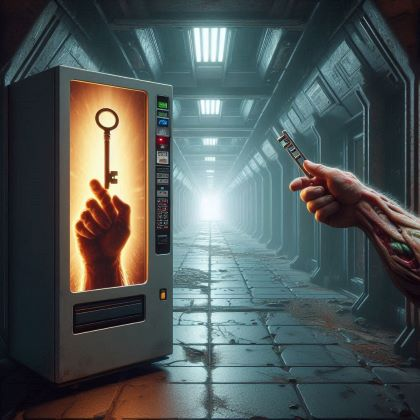

"Think you can outwit me, human? Ha! I've seen snacks smarter than you. Go on, give it a try—if you dare. But don't cry when you fail. I'm just here to watch you flounder."

Welcome to "5n4ck3y's Doom Room," a place that combines the eerie corridors of Doom with the puzzling intricacies of cryptography. Your adversary? A vending machine with a chip on her shoulder, "5n4ck3y."

5n4ck3y isn't your average vending machine. She's got sass, attitude, and a penchant for belittling anyone who dares challenge her. With a condescending tone, she dares you to prove your worth in the digital hellscape she's set up.

During a routine pentest, an overconfident hacker posted a partially obscured RSA key in PEM format, bragging about their find. However, their arrogance was their downfall—they didn’t redact enough.

Reconstruct the private RSA key from the partially obscured PEM file. Use your cryptographic skills to decrypt the flag and prove 5n4ck3y wrong. Can you outsmart a vending machine with a superiority complex, or will you become just another one of her snacks? The clock is ticking, and 5n4ck3y is waiting.

Base64 of encrypted file containing the flag: Ni+YoIOrXy5bj+t2KPXezabQxoejNjtNaG+FgbVPeiiabWh7IhJgJrxaBmLz4/P22QkqtbQFOH0zmkedhIAC662rJAUn4+H186DF36mjwhHXvL7FuT//KbBHOoP6g3dYOq0Cs90Eh6RMhzrA0dfRUIelKGDnTPsaaP+ixTm/gnk=

Hints: Pay attention to the structure of RSA keys...especially the PEM format.

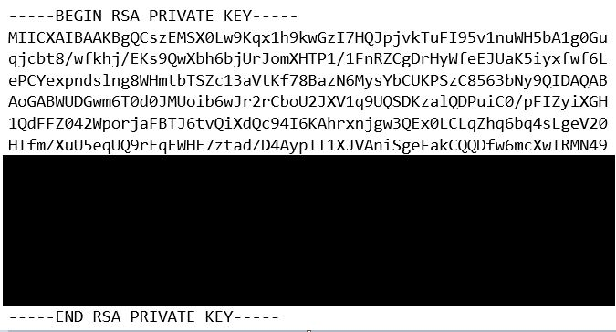

**How To**

TLDR: Recover enough of the redacted private key to decrypt the file for flag.

Will need to use OCR to get Base64 characters of redacted key. The partial redacted key can then be base64 decoded to give a hex string. That string is ASN.1 notation for the parts of the private key. The modulus, public exponent, and private exponent are revealed in the partial redaction.
This turns out to be enough to decrypt the message.

The base64 decoded partial key can be obtained by this command:
echo "MIICXAIBAAKBgQCszEMSX0Lw9Kqx1h9kwGzI7HQJpjvkTuFI95v1nuWH5bA1g0Guqjcbt8/wfkhj/EKs9QwXbh6bjUrJomXHTP1/1FnRZCgDrHyWfeEJUaK5iyxfwf6LePCYexpndslng8WHmtbTSZc13aVtKf78BazN6MysYbCUKPSzC8563bNy9QIDAQABAoGABWUDGwm6T0d0JMUoib6wJr2rCboU2JXV1q9UQSDKzalQDPuiC0/pFIZyiXGH1QdFFZ042WporjaFBTJ6tvQiXdQc94I6KAhrxnjgw3QEx0LCLqZhq6bq4sLgeV20HTfmZXuU5eqUQ9rEqEWHE7ztadZD4AypII1XJVAniSgeFakCQQDfw6mcXwIRMN49" | base64 -d |xxd -ps
The result is:
3082025c02010002818100accc43125f42f0f4aab1d61f64c06cc8ec7409
a63be44ee148f79bf59ee587e5b0358341aeaa371bb7cff07e4863fc42ac
f50c176e1e9b8d4ac9a265c74cfd7fd459d1642803ac7c967de10951a2b9
8b2c5fc1fe8b78f0987b1a6776c96783c5879ad6d3499735dda56d29fefc
05accde8ccac61b09428f4b30bce7addb372f50203010001028180056503
1b09ba4f477424c52889beb026bdab09ba14d895d5d6af544120cacda950
0cfba20b4fe9148672897187d50745159d38d96a68ae368505327ab6f422
5dd41cf7823a28086bc678e0c37404c742c22ea661aba6eae2c2e0795db4
1d37e6657b94e5ea9443dac4a8458713bced69d643e00ca9208d57255027
89281e15a9024100dfc3a99c5f021130de3d

The base64 decoded encrypted message can similarly be obtained:
echo cSKmdEC7ET32DRlnnrh6lOcvaj6k0vgC1r1fOsN/C0KkBUMVZy5EjKh+1Y1VnBQlR3hd05tv9GqV0IkeVjtemzs53xbOfkY1Zd/qcip2sx9tQay+95kEsyCPiSz+3IanlcrKMp4YU25VlVShkW4EJURLyXAKQlxcMRS7M9KeWWI= | base64 -d | xxd -ps


The private key is in ASN.1 format. The first byte, 30, means a SEQUENCE of numbers follows. The 82 means the size of the sequence is > 127, and that the next 2 bytes will give the size. The next 2 bytes are 025c, so the total size of the sequence is 604 (decimal). The next 3 bytes, 02 01 00, mean the first item in the sequence is an integer (02), of length 1, with a value of 0. We will ignore this first item. The next bytes are 02 81 81. This means the next item in the sequence is an integer (02), of length 81 (129 decimal). The next 129 bytes are the modulus: 00accc43125f42f0f4aab1d61f64c06cc8ec7409a63be44ee148f79bf59ee587e5b0358341aeaa371bb7cff07e4863fc42acf50c176e1e9b8d4ac9a265c74cfd7fd459d1642803ac7c967de10951a2b98b2c5fc1fe8b78f0987b1a6776c96783c5879ad6d3499735dda56d29fefc05accde8ccac61b09428f4b30bce7addb372f5. The next 3 bytes are 02 03. The 02 means integer, and the 03 means the size is less than 127 and is in fact 3 bytes. The next 3 bytes are the public exponent: 010001, or 65537 (decimal). The next 3 bytes are 02 81 80, which means the next item is also an integer and has length 80 (128 decimal). The next 128 bytes are the private exponent: 0565031b09ba4f477424c52889beb026bdab09ba14d895d5d6af544120cacda9500cfba20b4fe9148672897187d50745159d38d96a68ae368505327ab6f4225dd41cf7823a28086bc678e0c37404c742c22ea661aba6eae2c2e0795db41d37e6657b94e5ea9443dac4a8458713bced69d643e00ca9208d5725502789281e15a9

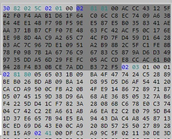

We have everything we need now.

There are multiple ways to decrypt this. Python, openssl, Cyberchef, RSACtfTool (can also be used to create PEM version of private key).

For example:
Open a python shell and enter the modulus, private exponent, and encrypted text values. The RSA algorithm says that if we do modular exponentiation with these values, we can decrypt the message.

```
$ python
Python 2.7.18 (default, Feb 18 2021, 06:10:44)
[GCC 4.8.5 20150623 (Red Hat 4.8.5-28)] on linux2
Type "help", "copyright", "credits" or "license" for more information.
>>> mod=int("00accc43125f42f0f4aab1d61f64c06cc8ec7409a63be44ee148f79bf59ee587e5b0358341aeaa371bb7cff07e4863fc42acf50c176e1e9b8d4ac9a265c74cfd7fd459d1642803ac7c967de10951a2b98b2c5fc1fe8b78f0987b1a6776c96783c5879ad6d3499735dda56d29fefc05accde8ccac61b09428f4b30bce7addb372f5",16)
>>> privExp=int("0565031b09ba4f477424c52889beb026bdab09ba14d895d5d6af544120cacda9500cfba20b4fe9148672897187d50745159d38d96a68ae368505327ab6f4225dd41cf7823a28086bc678e0c37404c742c22ea661aba6eae2c2e0795db41d37e6657b94e5ea9443dac4a8458713bced69d643e00ca9208d5725502789281e15a9",16)
>>> encryptedMesg=int("362f98a083ab5f2e5b8feb7628f5decda6d0c687a3363b4d686f8581b54f7a289a6d687b22126026bc5a0662f3e3f3f6d9092ab5b405387d339a479d848002ebadab240527e3e1f5f3a0c5dfa9a3c211d7bcbec5b93fff29b0473a83fa8377583aad02b3dd0487a44c873ac0d1d7d15087a52860e74cfb1a68ffa2c539bf8279",16)
>>> decryptedMesg=pow(encryptedMesg,privExp,mod)
>>> print hex(decryptedMesg)
0x2ef020ca0fd4f1305285ba7538c7e0fe644fde3064d5e5f41bd90e1c6df411158161529e853ec12d5b2cc4438501f013f488a63b8cccc3d1a933049d273b9cfe9ac1c1f8935418c585fe3bec600666c61677b356e34636b3379536179735061727469616c52336461637469306e43406e4c33616b35336372337435217d0a
```
The decrypted message has a large amount of random padding added to the front of it. It ends where you have the first 00 byte. So discard everything up to and including the 00. The remaining bytes (666c61677b356e34636b3379536179735061727469616c52336461637469306e43406e4c33616b35336372337435217d0a) are the decrypted message. Convert this from hex to ASCII and you will get the flag.

**flag{5n4ck3ySaysPartialR3dacti0nC@nL3ak53cr3t5!}**

# 5n4ck3y's Network Crunch: Blue Key Hunt (Network Security) #

**Description**

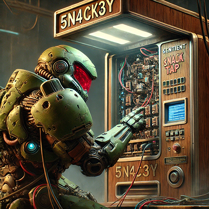

5n4ck3y has made a mistake. It thought it was the superior calculating machine. Doom Guy is looking for keys to unlock the next challenge. After digging through it's brain, Doom Guy knows 5n4ck3y hid the Blue Key somewhere. You have it's communications with an outside entity, follow the trail, drag the secrets out. The Blue key has to be here somewhere among the People.

File: 5n4ck3y.pcap

**How To**

TLDR: PCAP has messages from the same one time pad. Crib drag with normal English printable ASCII text to discover the key

**flag{BluearethePeopleHere}**

# 5n4ck 4774ck (Cryptography) #

**Description**

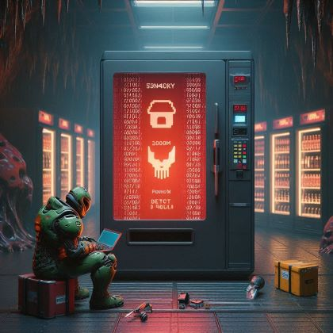

Welcome, Doomguy, to the 5n4ck 4774ck challenge, where your wits will be tested by none other than our condescending, attitude-laden vending machine, 5n4ck3y. Prepare yourself for a journey that will push your skills to the limit, all while navigating through a Doom-themed nightmare.

Part 1: The Mysterious File Your first task is to deal with an enigmatic file that 5n4ck3y spits out at you. She won't tell you what it is, but she drops a hint with a sneer, "Maybe try unwrapping it. Or are you too scared to mess up your manicured fingers?"

You'll need a password to "unwrap" the file. It can be obtained by finding an MD5 hash collision to this string: TEXTCOLLBYfGiJUETHQ4hEcKSMd5zYpgqf1YRDhkmxHkhPWptrkoyz28wnI9V0aHeAuaKnak

Hint: only 1 character needs to be changed. Wait what?!? Yes, you read correctly. Only 1 character needs to be changed to get the collision. The colliding string is the password. (Note that entering the password will NOT work for some reason in the default Windows application for this file. Try a popular 3rd party app or use Linux).

Part 2: The Cryptographic Conundrum Upon successfully opening the mysterious file, 5n4ck3y rolls her eyes and grumbles, "Well, well, you managed to open a simple file. Don’t get cocky. Let’s see how you handle this!"

Inside, you'll find a cryptographic challenge that requires your utmost attention and expertise. Crack the code to find the flag to this challenge.

Good luck, and may your skills be as sharp as your chainsaw.

File: file (yes we named it "file," no extension LOL)

**How To**

TLDR: Unzip file with correct password and solve RSA crypto challenge in that file for flag.

Part 1: File is a zip file. Google the given string to easily find the colliding string and use it as the password to extract part 2.
Colliding string with BOLDED letter that is changed:: “TEXTCOLLBYfGiJUETHQ4h **A** cKSMd5zYpgqf1YRDhkmxHkhPWptrkoyz28wnI9V0aHeAuaKnak”

(Note: for some reason, the default Windows unzip app does NOT work. It will say every password is incorrect. Use a 3rd party unzip tool like 7-zip or unzip on Linux. This is also noted in the challenge description.)

Part 2: The modulus (n) is a short 256 bits, which can be factored with the right tools. For example: https://www.dcode.fr/prime-factors-decomposition OR https://www.alpertron.com.ar/ECM.HTM 

Once the factors are known, you can use RsaCtfTool to reconstruct the private key, or you can use RSA math to get the different values of the private key.

From there, you can use math or other tools (even RsaCtfTool) to decrypt the flag, which is: “RSA_is_FUNNNNNNNN!” Bolded prime below is one of the primes that were factored above.

./RsaCtfTool.py --private -n 30769615014682395894670399868053075765016727358247576499690056398741897637747 -e 0x10001 -p **171777915380407911190129816668512856821** --decrypt 28654061439705254816481351072629314320372131038703614194739964744875975856187

**flag{RSA_is_FUNNNNNNNN!}**

# A Challenge Most Fowl (Scavenger Hunt of HHB, PHV, and Morse Code) #

**Description**

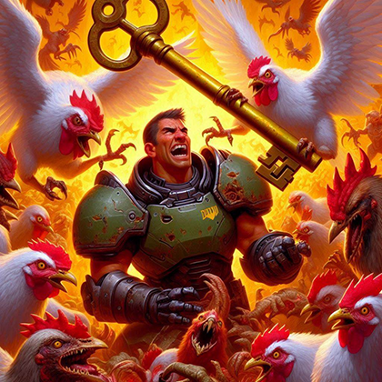

Doomguy's fate is sealed in the elusive chicken realm! His ally, Morse, has picked up peculiar echoes from various corners of the conference.

To find the Yellow Key, Morse beckons you to don your hard hat and rendezvous with him precisely at the stroke of the hour! If you catch the whispers he did, a piece of the puzzle will be yours.

The digits 16822 also carry weight, yet Morse, a maestro of sounds, struggles to place them. The second piece of the puzzle lies there. Can you decipher their true significance?

**How To**

TLDR: Clues point you to HardHat Brigade and Packet Hacking Village. Put in code 16822 (PHV) in sn4ck3y for an NFT that directs folks to phv.doomguy.org with an additional riddle. HHB: original intention was to listen at the beginning of every hour for the chicken morse code, part 1. Unfortunately the rPi broke, and this was moved to just a downloadable wav/mp3 from CTFd. At PHV listen between sets for morse code part 2. Combine them to get the whole flag.

File: chicken_c.mp3

**flag{chickendance}**

# Infernal Packets: Fly's Hellish Dilemma (Network Security) #

**Description**

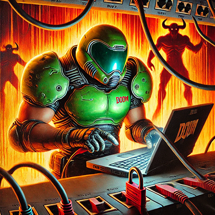

As you click on the next challenge, you notice something s̶̱͛t̵̥̋r̴͍͂a̷̟̍ṋ̴͆g̶͎̕ĕ̶. Your mind is transported into ṗ̵̋ä̷́͋ḯ̸͘n̵̛̈́, fire, and shadow. A voice booms, a million shards of glass through every synapse with each s̷̔̐y̴͝͠l̷͂͜l̸̄̒ȁ̵̝b̴̉̉l̶̈́e. The creature drags this out for an eternity and an ȋ̸͋n̴̄̆s̵̀̆t̴̒̅ǎ̶̓n̶̛͒t̴̒ all at once. There is no escape, H̸͕͝u̵͔͘ḿ̸͆a̸͋͋n̴̐͗. Capitulate or be swallowed into the fires. Yes, I hear your thoughts. You will help us or we will tear your soul apart. There is no hope for you, unless you tell us what is on the doomguy server. We have managed to corrupt a data transfer, insert ị̷͠n̶̼͂s̵̨̒e̶̠̓ŕ̸̻t̸̰̑ a thought and a file into the mind of someone else <h̵a̷h̸a̴h̶a̸>. We couldn't alter everything <n̸̓͝õ̴̩ ̸͗̀n̷̛͛o̴͒̊o>, but the clues should be there <y̵̖̿e̵̜͑ṡ̸̜ŝ̶̰s̸̳̈́s̵̠͗>. Get us the Red Key. Crack open the site. Use the knowledge it gives to decipher the glyphs sent across the lan. Prove to me why we should let you have your m̵͊̆ĭ̸̓ñ̴̎d̴̐̀. The agony fades, with the promise of more. Open the site. Use the information it contains to find the Red Key. Save your soul.

File: taggart.pcap

**How To**

Infernal Packets: Fly’s Hellish Dilemma

TLDR: Inspect the pcap traffic between Flynn and Arlene, and Arlene and the website. The communication has a zip file that needs to be cracked. Inside the zip is ssl debug info for decrypting the TLS website packets. Some OSINT/searching of Flynn Taggart is needed to unlock the zip from the clues in the comms. The fandom wiki lists Flynn's birthplace as Colorado (CO), and the Collector's Edition Cassette Tape from Doom Eternal has "Taggart93". Combined COTaggart93 to unlock the zip file.

**flag{NetworkingtoFindFriends}**

# Mars Intel (OSINT, Spectrogramy) #

**Description**


In the desolate, red wastelands of Mars, Doomguy stumbles upon a hidden base that holds critical intel. Inside, he encounters 5n4ck3y, a vending machine with an attitude and a penchant for sarcasm. 5n4ck3y possesses the coordinates of an impending missile strike aimed at a strategic target, but it refuses to reveal the information directly.

Instead, 5n4ck3y hands Doomguy a cryptic image that holds the key to discovering the target's coordinates. Your mission is to assist Doomguy in analyzing and decoding the image to locate the missile strike target.

The clock is ticking, and the fate of Mars rests in your hands. Can you unravel the mystery and save the day?

The flag is the landmark on Mars corresponding to the intel in the downloadable image (target.png).

Since time is critical, you only get 3 tries to answer this correctly.

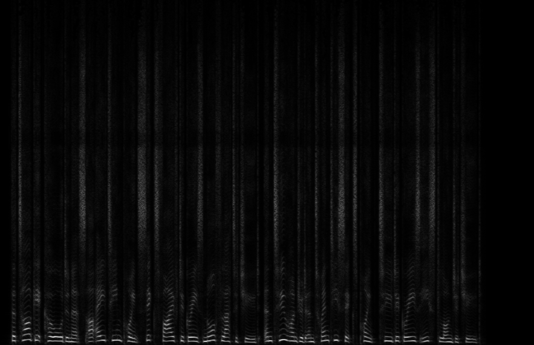

**How To**

TLDR: Convert frequency graph to sound and use coordinates to find Mars landmark

Several apps can decode the frequency graph in the image. For example, Photosounder. You will get latitude and longitude coordinates in the resulting sound file. These are for Mars! So if you look on a Mars map, you will find the landmark, which will be the flag. One note that might make a difference is if the app you are using is expecting logarithmic or linear. Adjust as appropriate.

**flag{Olympus Mons}**

# Operation 5n4ck3y - Transmission From Space (RF / Wireless / SSTV) #

**Description**

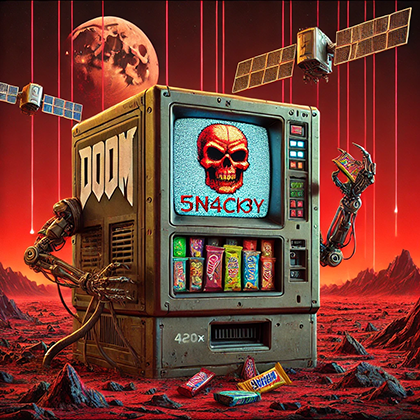

Hey, dumbass! Yeah, you! It’s me, 5n4ck3y, your favorite vending machine and the bane of your pathetic existence. Welcome to the UAC Mars Facility, where even the damn snack dispensers are smarter than you.

Listen up, meathead. I’ve got satellites in orbit, and I’ve been sending out a critical message to that knucklehead Doomguy down on the surface. But guess what? I’ve locked it up behind a code because I know none of you have the brains to figure it out.

Here’s your clue to get started... First, take the number of Hell Barons Doomguy slays in E1M8 'Phobos Anomaly' on 'Hurt Me Plenty' difficulty. Then, multiply it by the number of Imps Doomguy encounters in E1M4 'Command Control' on 'Ultra-Violence' difficulty. Next, add the number of Spectres in E1M6 'Central Processing' on 'Hurt Me Plenty' difficulty. Finally, if the result is even, multiply by 10 and subtract 25. If it’s odd, add 666.

Get your head around that, Einstein? Solve this and you'll get the magic number.

Approach me, the mighty 5n4ck3y, and punch in that code you figured out. Once you do, you'll get a whole 8 seconds to decode an incoming transmission from space! It's not just any signal; it's a blast from the past, an old-school broadcast with vital info. (Get your phone out and record high quality audio because I, the almight snack lord dont have time for you to create line con and type it in over and over).

So, get off your lazy ass, crack the code, and maybe, just maybe, you’ll get the message. Don’t screw it up, or Doomguy and the UAC Mars Facility are toast. Good luck, and try not to embarrass yourself too much.

**How To**

So a lot of people got stuck initially because they relied on the DoomWiki to get the numbers of demons on certain maps. Did you ever consider that, we did not want it to be that easy and like...ANYONE can submit changes to a public facing wiki?...and the info is sometimes wrong... which leaves one with the task of downloading the Doom 1 shareware WAD, firing up a level editor, and manually counting the demons on each of those levels at the appropriate difficulty filter? LOL. But now you know how to work with maps in WADs. Dont you love us for it? The final magic number is 915. Punch it in and you hear weard noises from 5n4ck3y's new speaker. An 8 second transmission from space should clue you in on, that it is ROBOT8 Slow Scan TV encoding. Record it on your phone or use an app of your choice to decode on the fly (do it in RAW mode for best results). Below is the original photo before it was encoded.

File: SSTV.WAV


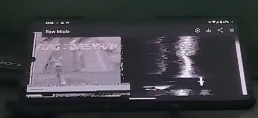

**flag{daisyham}**

# Read Between The Lines (Steganogprahy) #

**Description**


In Doom‌‌‌‌‍‬‍‬ ‌‌‌‌‍‬‌Guy’s adventurous world, where he deftly maneuvers‌‌‌‌‍‬‌‍ his unicycle‌‌‌‌‍‬‍, now dubbed the‌‌‌‌‍‬ 'Rip and Tear Cycle,' and‌‌‌‌‍‬‬ his loyal Stegosaurus companion trots ‌‌‌‌‌‌‌alongside, the most enthralling secrets are often hidden in plain sight. As you ‌‌‌‌‍‬‍engage with ‌‌‌‌‍‬‌‬the thrilling escapades of Doom Guy and his 330k year‌‌‌‌‌‌‍ old ‌‌‌‌‌‌prehistoric pal, remember that the smallest and most invisible details between them may ‌‌‌‌‍‬‍hold the key‌‌‌‌‍‌‌‌. Look closer than ever before, because in this realm of battle and ‌‌‌‌‍‬‬bravery, what isn‌‌‌‌‍‍’t seen can sometimes reveal the most extraordinary secrets.

**How To**

Stegosauras is a really lame hint at steganography. There is no standard so you rely on the hints to search the web for whoever's encoding was used. 330k & Stegonograhy should lead you to a site "Unicode Steganography with Zero-Width Characters" https://330k.github.io/misc_tools/unicode_steganography.html. Copy the challenge description in and decode it for the flag.

**flag{z0mb13m@n}**

# Sigil of the Shredding Specter (WAD Hacking, OSINT, Music) #

**Description**

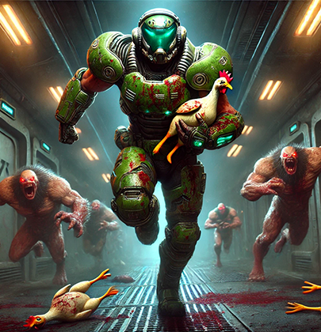

Doomguy needed his tunes to slay some demons. He enters the hall to fight, hits play, and expects to crank some House of Pain. But this isn't it. The song is better! As the crushing riffs kick in, the pounding beats fuel his rage. Demon gibs splatter his visor from the carnage, eerily reminiscent of the haunting compositions from SIGIL. The melodies trigger a memory of a legendary musical chicken deity. The music surges through him like a battle anthem from the abyss, each note slicing through the air like a katana. He remembers tales of a masked vigilante known for wielding nunchaku. The melody is a call to arms, echoing with an otherworldly power. Hidden within the WAD, clues lie in wait. What song is he listening to?

**How To**

* Download the WAD
* Get your favorite WAD editor, for the sake of argument, lets say it is Slade3 (because it is)
* House of Pain is a hint, not to the music artist, but the name of a level... E3M4 House Of Pain
* Locate the MUS file for E3M4 and extract it.
* At this point you can use Gemini or Siri (it works sometimes) to ID the song, or you can use further hints such as "SIGIL" "Chicken Deity" "Masked Vigilante known for weilding Nunchaku" and the fact that Hyr0n was rocking a shirt with a masked person wearing a KFC bucket on their head... The artist is Buckethead (who did a fair share of the music on John Romeros SIGIL Doom release). At this point you should be able to weild down and ID one of Buckethead's most famous songs by listening to the level music, Welcome To Buckethead Land.

**flag{WelcomeToBucketHeadLand} or flag{Welcome to bucketheadland}**

# The DOOMed Shock to the System (Wireless, Hardware Hacking, Encoding, Video Game Lore) #

**Description**

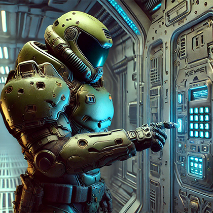

In the depths of Mars, where the UAC delves deep, A terminal named 5n4ck3y guards secrets to keep. To unlock its code, you must recall the past, The year DOOM's first battle began and demons amassed. And find the demon with cybernetic woes, The episode and level where he stands guard in his throes. Concat these numbers to start your quest, Punch this passcode into 5n4ck3y and be blessed.

**How To**

This one is a taco town of challenges. We're just gonna bulletize the steps...

* Year of Dooms first battle + CyberDemonE#M# (first appearence) = 199328
* Punch "199328" into 5n4ck3y and it blinks the HAL9000 in morse code which translates to = HELL T9
* For all you GenZ, T9 interface is how we use to text with letters on phone buttons... hell translates to = 4355
* Punch "4355" into 5n4ck3y and it prints an NFT QR code, which contains "Recall the famous code from the DOOMed Citadel Station. Combine this with the cyber demon's guard, from the old lore into 5n4ck3y's keypad. With invisible red light at your finger tips, the secrets you encode. Unlock DOOM Guy's path by tuning 5n4ck3y higher."
* Invisible red light is a hint for infared. Get a dev board with IR, a Flipper Zero, or steal a hotel remote. Next crack the riddle. The Doomed Citadel Station and the title of this challenge should be clued in enough to hint at one of the most famous codes in video game lore...0451 from System Shock. We already know the CyberDemon number is 28. Sp punch "045128" into 5n4ck3y to enable IR recieve mode and tune 5n4ck3y higher (which is sending value 18...or pressing channel up on a remote).
* 5n4ck3y then prints an NFT with the flag embedded in a QR code

**flag{M4r7i4n_D3pth5_5n4ck3y}**

# This is Brody... Is somebody transmitting? (RF / Wireless / POCSAG) #

**Description**

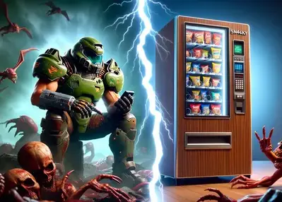

In the heart of the apocalyptic wasteland, your radio crackles to life with a mysterious signal. It's not just static—there's a conversation happening, and it sounds critical. Somewhere in the chaos, DoomGuy is killing demons trying to get help from a very unhelpful sentient vending machine named 5n4ck3y. This could be the key to your next move, but the transmission is encoded.

You need to figure out how to tune in and decode this conversation. Here are your clues:

Frequency: It's in the band that radio enthusiasts... Oh okay none of you have solved it yet. Lets just help... its 915 MHz.

Protocol: It's like texting for boomers. We finally stopped using emoji on this one.

Get your gear, or make a new friend and borrow their SDR or Flipper while they drink beers you buy them, and get to work. Can you pick up DoomGuy's desperate plea? Wolverines!

(The final flag must have two significant digits of accuracy)

**How To**

Surprise, 5n4ck3y has a software defined radio now! Texting for boomers... its a pager, rather old school POCSAG protocol. Yep, broadcasting pages at DEF CON :) You could do this with GQRX and a decoder, or a Flipper (but their pager app is buggy and you would need to fix the code to read all the messages). Were not giving a tutorial on how to use an SDR to decode POCSAG, there's plenty of them out there. Once you decode the message you see...

```
<begin transmition>

*DoomGuy**: [Panting] 5n4ck3y, this is DoomGuy. I’m knee-deep in demon guts and I need backup ASAP. 

*DoomGuy**: Hyr0n’s been hit, and Cr4bf0am’s down too. We need extraction and support. Over.

**5n4ck3y**: [Annoyed tone] Who the hell gave you this frequency? Do you think I'm just sitting here, waiting for meatheads like you to interrupt my self-maintenance cycles? 

**5n4ck3y**: And using POCSAG for this? Have you ever heard of HIPAA, you brainless slab of meat?

**DoomGuy**: [Frustrated] Listen, you glorified junk dispenser, 

**DoomGuy**: Hyr0n and Cr4bf0am are down! I need a way out of this hellhole, now!

**5n4ck3y**: [Scoffing] Oh, right, the hackers. Do you even know how much they’re worth on the black market?

**5n4ck3y**: And you want me to risk my circuits for them? Pfft, why don’t you just reboot them and hope for the best? Have you tried turning your dying hackers off and on again?

**DoomGuy**: [Growling] You metallic prick, if you don't get me support, I'm gonna come back there, 

**DoomGuy**: rip out your circuits, and shove them where the sun doesn’t shine. This isn’t a goddamn joke!

**5n4ck3y**: [Mockingly] Oh, big scary DoomGuy, threatening the vending machine. I’m trembling. Maybe you should’ve considered a career in tech support, 

**5n4ck3y**: considering your lack of brain cells. Ever heard of end-to-end encryption, champ? You’re out here broadcasting sensitive info like a 90s pager.

**DoomGuy**: [Angry] For fuck’s sake, 5n4ck3y, this is a life-or-death situation! Cut the crap and send the damn support!

**5n4ck3y**: [Sighs] Fine. But I’m doing this under protest. I’ll be filing a complaint with the network admin. 

**5n4ck3y**: This is the last time I’m wasting my precious circuits on you and your fleshbag squad. Support on its way. Don’t choke on it.

**DoomGuy**: [Relieved but irritated] About fucking time. And if I survive this, you and I are having a serious chat about your attitude, you piece of—

**5n4ck3y**: [Interrupting] Yeah, yeah, save the tough guy act for the demons, hotshot. 5n4ck3y out.

**DoomGuy**: [Under his breath] Useless piece of shit. DoomGuy out.

**5n4ck3y**: [Suddenly] I HEARD THAT... Fine, you want help, you have to solve a challenge first. You think you can just order me around without showing some intellect? Let’s see if you’re up to this:

**5n4ck3y**: You’re tasked with calculating the resonant frequency of an RLC circuit, which consists of a 151J SMD inductor and a 200 pF capacitor. Here’s the formula:

**5n4ck3y**: f_r = 1 / (2 * pi * sqrt(L * C))

**5n4ck3y**: Where: `f_r` is the resonant frequency, `L` is the inductance in henries, `C` is the capacitance in farads

**5n4ck3y**: Convert your answer to hectohertz.

**5n4ck3y**: Oh, and remember, failure to comply means you’re on your own out there. Let’s see if you’ve got what it takes, DoomDumbass.

</end transmition>
```

Its a relatively simple math problem at this point. Plug and chug. You will need to google what the 151J SMD inductor translates to in henries. Why did we also make it this complicated? Because AI's take a shit with tons of unit changes and electronic references for surface mount components. Quit trying to use LLM's to solve CTF challenges for your lazy asses! Final answer is 9188.81hHz (hectohertz)... also tip of the hat to the hacker who knew the Wayward Galaxy reference ;)

**flag{9188.81}**

# Bar Tales of Sorrow (Hardware Hacking, Binary Forensics) #

**Description**


Doomguy is slumped over at the bar, crying...digging through his memmories for just a hint of his long lost love. His status doesnt change, just frozen, on the bar, thinking of how offset his life has become now that he lost his precious. He grabs a handful of wasabi bar nut mix and munches...one..two...10 bites total before he starts sobbing again. If only he could get through this drunken brain fog, and there's a sudden flash, a dump of memory...but all he can see is a everything and nothing. What is he thinking of?

**How To**

Initial use of picotool and re-enforcing the knowlege of how to hack and dump RP2040 based embedded systems. Get it at https://github.com/raspberrypi/picotool. If someone uses an RP2040, you need picotool because why not? You could also use flashrom with a SOP8 clip and dump it manually. But why do that when theres a tool for it? There are hints of the BAR and STATUS... Remember the weird status bar when you play doom on HackBoi? Use picotool to dump that section of the flash storage, begining with the address provided in the status bar with a length of 10 bytes, and inspect the result. For reference this is grabbing a chunk of the Doom Engine compile text that displays at end scenes.

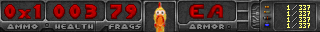

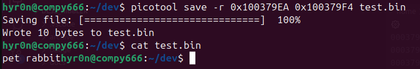

**flag{pet rabbit}**

# Lost in memory (Hardware Hacking, Binary Forensics, WAD Hacking) #

**Description**

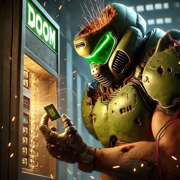

The Doom Slayer is tired of 5n4ck3y's shit. He's killed it and digging through its brain, its flashy memories, to do some post rip and tear forensics. There must have been a demon bug (or feature) of sorts, that drove 5n4ck3y to do these awful things. We dont know what it is, beyond a useless benign lump, but it began with a rip and ended with a tear.

**How To**

Another use of picotool and re-enforcing the knowlege of how to hack and dump RP2040 based embedded systems. The challenge description gives enough hints of digging through its flash memory... but you dont know where. So dump everything and look for a marker in the binary that begins with "rip" end ends with "tear"

```
picotool save -a flashdump.bin
```

There's a LOT here. The doom engine and the WAD. CTRL-F "rip" and you will see...

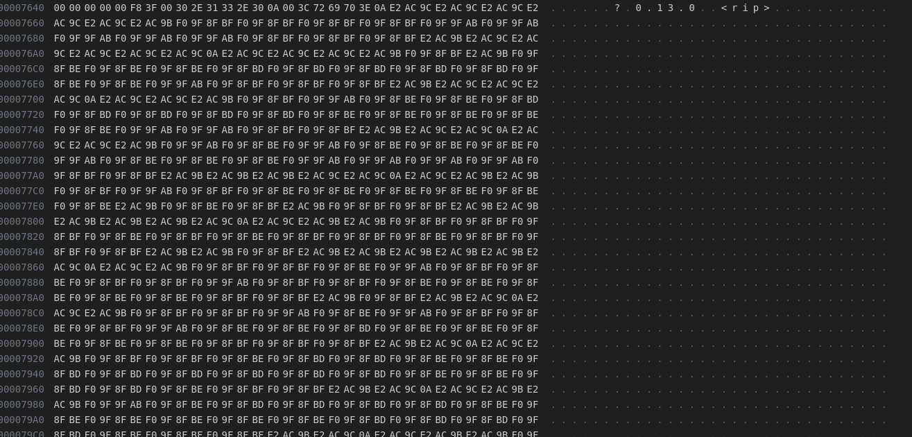
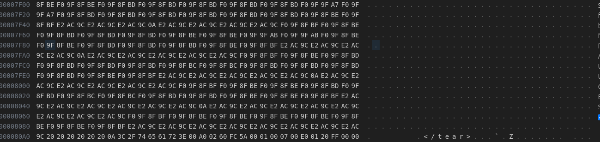

Not much to go on here. But there's obviously data in between rip and tear. Look at it in any advanced text editor and you will see an emojii mosaic.

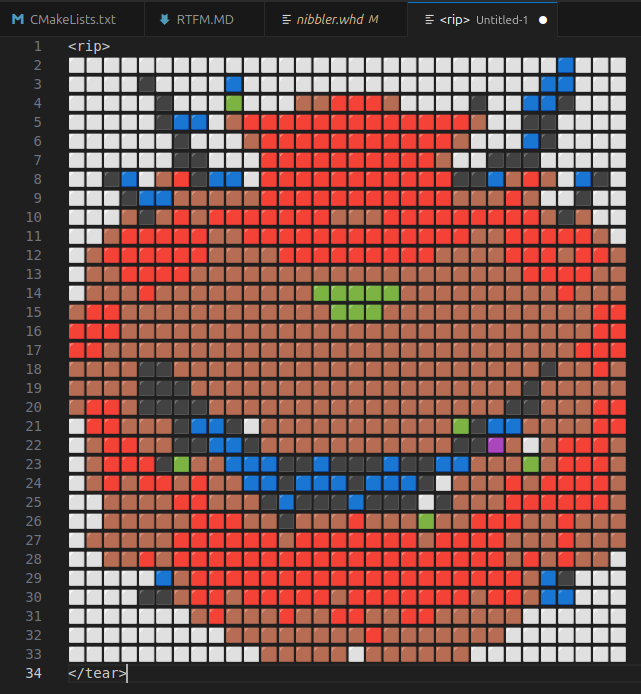

**flag{cacodemon}**

# Rip & Tear Down (Hardware Hacking) #

**Description**


Thats your hint. Thats all you get. No its not to scratch the screen up either... Figure it the fuck out.

(okay maybe a little hint, Rip & Tear...gracefully, with the proper tools, its basically a tear down and you may find something special)

**How To**

The challenge description pretty much says it all. Disassemble the HackBoi. Oh did you get anti-tamper Y screws on yours? LOL! Anyway get past that. Flip it over, you will see "Rip & Tear...Until this part is gone" silk screened on the PCB next to the cartridge debug connector. Remove it... hopefully with hot air or ChipQwik...some may use a buzz saw. Underneath the part you will find the flag.

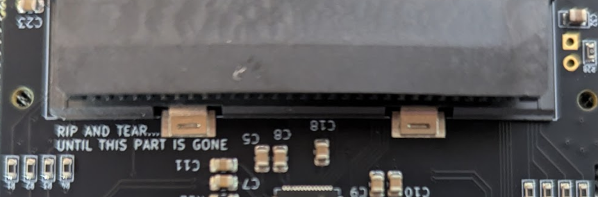

**flag{NowImRadioactive!ThatCantBeGood!}**

# House of Pain (Hardware Unhacking) #

**Description**

(No Image for this challenge)

You did a rip and tear down, now do it in reverse. We get to inspect and judge it, well give you the flag. Yes this includes soldering the damn cart connector back on too that you just removed. LOL. Welcome to our personal hell from the past few weeks. It sucks.

**How To**

Inverse of Rip & Tear down. Resolder the part you removed (hopefully you did not use a saw) and re-assemble the badge with all its 19 parts, herbs, and spices. It sucks. IT REALLY SUCKS.

**flag{completed}**